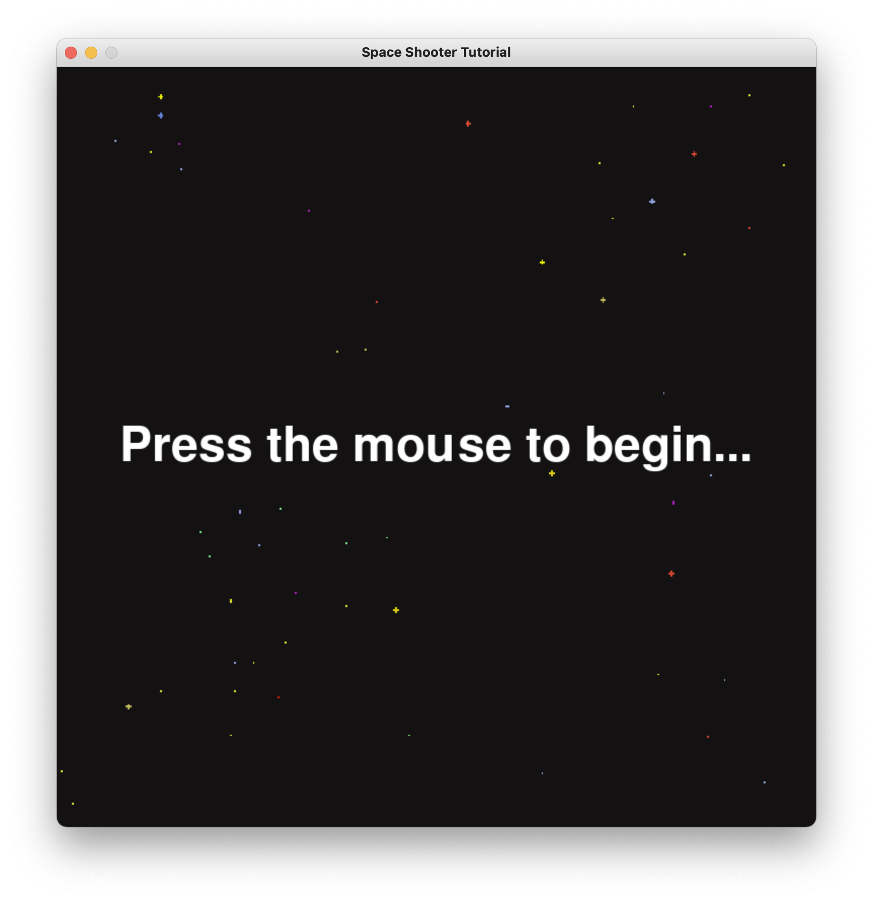
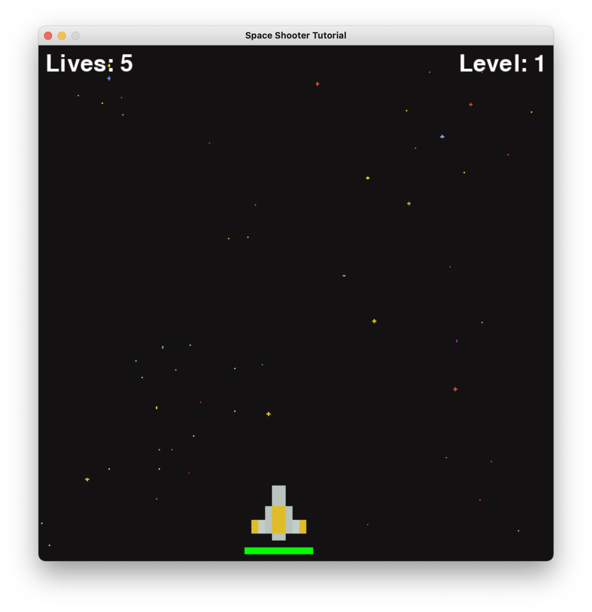

# Space Invaders
Space Invaders, flavored in Python. Written with pygame, as an interactive game for users to enjoy with their keyboard and mouse. Features health status, increased levels with corresponding difficulty, and a friendly user interface.

## Background
This program is written in python, for the user functionality and calculation aspect of the game. It utilizes a module (namely Pygame) in order to offer a GUI for the game, along with linking assets (such as images for a background, main character, or invaders) to the back end of the program.

## How to play
Came here just to play the game? No problem. Here is how to get the game set up, with all of the game rules.

### Installation
- Download the source code from this repository, with all of the assets

- Extract the code by double clicking on it (on Mac) or right clicking and hitting "Extract All" (on Windows). 
- Open the code in your preffered IDE or text editor, while setting the syntax to python. 
- Install the needed dependencies by running ```pip install pygame``` in your terminal (run ```pip3 install pygame``` if you have multiple versions of python on your computer, or if you have a Mac)
- Run the program by clicking the nessesary buttons in order to do so (you can also run the program in the terminal by running ```python3 main.py``` after navigating to the correct directory ```\downloads\space-invaders-master```.

- Wait for the game to index, and have fun playing!

### Rules of the Game
- You are the main space ship, with the health bar. Your job is to keep the ships from crossing you (or "invading" your territory).
- You must keep the space ships from crossing your current spaceship position, or you lose a life out of your given 5.
- You must also maintain your health bar, as if it runs out you lose the game. These "invaders" will be shooting at you, and if your ship comes into contact with their bullet or their spacecraft itself, you lose a portion of your health.
- You can move the ship anywhere on the game board by using the WASD keys.
- You can shoot back at the "invaders" by hitting the spacebar.

## Gameplay
Here are screenshots of some gameplay.

## Starting Screen
Here is an example of what the user is greeted with before starting the game.


## Entered Game
Here is an example of the game initially being started, with lives on the left and the level on the right


## Action
Here is an example of enemy ships "invading" the home territory, also showcasing that health can be depleted if one of the bullets or space "invaders" come into contact with the ship


## Increased Difficulty with Levels
Here is an example of the levels increasing every time the user meets the threshold of defeating the required number of ships or maintaining their health for a certain amount of time (varying per level).


## Lives Lost Functionality
Here is an example of lives being lost if spaceships get past your avatar (which is based on your movement). 


## Lost Gameplay
Here is an example of what the user experiences once they have run out of lives or health.


## Dependencies Utilized
- Python
- Pygame (Python Module)
